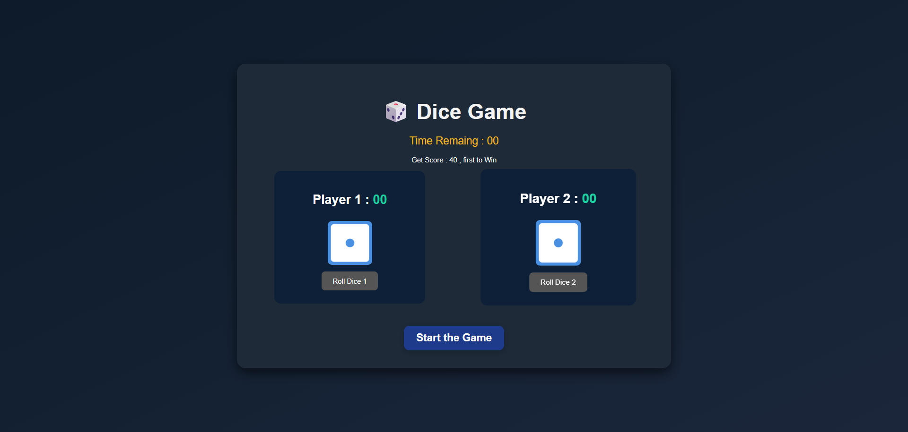

# 🎲 Dice Game - Ludo Style

Welcome to the **Advanced Dice Game**, inspired by Ludo rules! Built using HTML, CSS, and JavaScript — featuring a timer, rolling animations, score tracking, and win logic.

---

## 🚀 Live Demo

> [Click here to play online](https://agravi987.github.io/DiceGame/)  
> _(replace with your GitHub Pages URL)_

---

## 🎮 Game Features

- Two-player dice game
- Timer countdown for each turn (10 seconds)
- Rolling a **6** gives an extra chance
- First player to score **100** wins
- Rolling dice animation
- Dark blue modern UI with glowing effects

---

## 🛠️ Tech Stack

- HTML5
- CSS3 (Custom Dark UI Theme)
- JavaScript (Vanilla)

---
